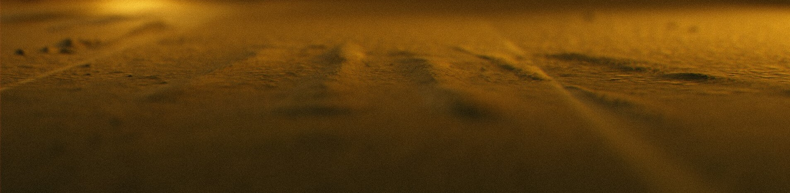

# Kutlualp Tazefidan 👨‍🔬 🧞   
👋 Hello my dear!  

I'm an aeronautical engineer from Berlin/Germany, who enjoys coding.  

<ins>Expert in </ins>
* Analytical composite calculation
* Material characterisation
* Finite Element Simulation

<ins>Learning: </ins>
* 💻 JavaScript
* 🎨 Blender
* 🚙 Crash-Simulation

## Languages

 

## Basic Knowledge in

 

## Engineering tools
* Ansys Workbench
* Abaqus
* Nastran/Patran

## Let's keep in touch

  

or  

  

